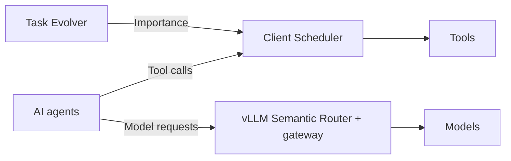
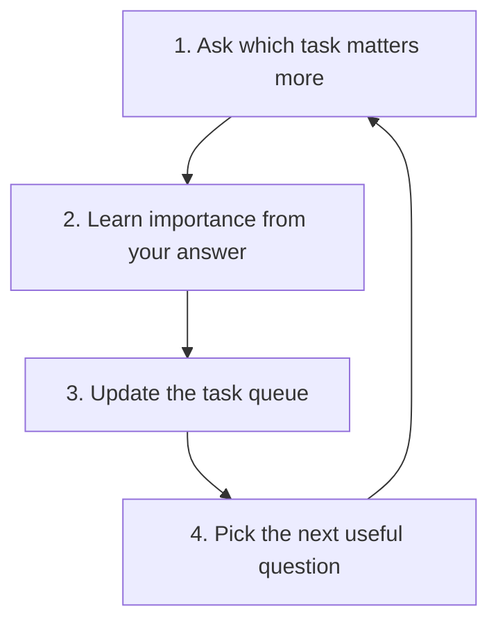

# IASES

**Importance-Aware Self-Evolving Scheduler for AI Agents**

Help AI agents decide **what matters, which tools run next, and which model to use**.

The demo simulates a wafer-fab incident competing with background tasks. It is inspired by TSMC operations, but is not affiliated with TSMC.

## Architecture



Simplified view. The frontend is mock, HierShrink is not enabled in live routing, and the combined system still needs end-to-end validation.

## Three main components

### 1. 🧠 Task Evolver: What matters?

- **Ask:** select a useful task pair and collect a human score from 0 to 1.
  Use 1 for A, 0 for B, or 0.5 for equal importance.
- **Learn:** fit importance scores with Bradley–Terry and expand related tasks with an LLM.
  Human preferences take precedence over low-weight AI-derived pairs.
- **Update:** publish new scores while scheduling continues.
  Each service run asks at most 10 questions.

### 2. ⏱️ Client Scheduler: What runs next?

- **Coordinate:** share a tool-call queue across Codex sessions.
- **Prioritize:** rank waiting tasks by importance plus waiting time.
  Aging raises the priority of tasks that wait longer.
- **Control:** limit concurrent tool calls.
  Release slots when calls finish.

### 3. 🔀 vLLM Semantic Router: Which model should respond?

- **Classify:** identify the request type, such as a summary or incident diagnosis.
- **Route:** send summaries to a low-cost model and diagnosis to a stronger model.
- **Compare:** support quality-cost selection with the custom HierShrink selector.
  HierShrink is not yet enabled in the live gateway.

**Importance is not model difficulty.** Tool scheduling and model selection are separate decisions.

### Task Evolver loop

**Ask → Learn → Schedule → Repeat**



## 🚀 Start with Docker

Install Docker with Compose v2. No local Node, Python, Rust, or Go setup is needed for these services.

```sh
cp .env.example .env
docker compose up -d --build --wait
```

Open **http://localhost:5173**. Trigger an incident and compare scheduling policies.

The default stack starts the **mock frontend and real shared admission service** without an API key. The Evolver CLI uses the same persistent data volume. The frontend is not connected to these backend services.

```sh
docker compose ps
docker compose logs --tail=50
docker compose down
```

Startup waits for health checks. Data survives `down`; `down -v` deletes it. If a port is busy, change `DEMO_PORT` or `SCHEDULER_PORT` in `.env`.

<details>
<summary>Teach importance and connect an agent</summary>

Set `INCIDENT_CWD` in `.env` to the absolute incident repository path reported by your Codex client. Start the stack before entering comparisons. Run one Evolver writer at a time.

```sh
docker compose run --rm evolver compare incident background --score 0.9
```

Without an API key, the human answer still updates importance; LLM expansion reports an error. Set `OPENAI_API_KEY` and `TASK_EVOLVER_MODEL` to enable expansion. Do not expose these unauthenticated services beyond your machine.

For tool admission, start a Codex binary built with our scheduler integration:

```sh
export CODEX_SCHEDULER_SERVICE=127.0.0.1:8765
codex
```

Use the configured `SCHEDULER_PORT` if you changed it. Stock Codex does not contain these hooks; build instructions remain in the development section. The Compose stack does not build or launch agent sessions.

`SCHEDULER_SLOTS` and `SCHEDULER_AGING_RATE` control admission. `SCHEDULER_CPUS` and `SCHEDULER_MEMORY` limit the scheduler container, not tools running on the host. CPU and RAM bars in the frontend remain simulated.

</details>

<details>
<summary>Enable live OpenAI routing</summary>

Set `OPENAI_API_KEY`, `FAST_MODEL`, and `ANALYSIS_MODEL` in `.env`. Choose models available to your account. Keep the pinned `ROUTER_IMAGE` from `.env.example`.

```sh
docker compose -f compose.yaml -f compose.live.yaml up -d --build --wait --wait-timeout 180
curl --fail http://localhost:18899/healthz
```

Live mode adds the official CPU Semantic Router image and our Responses gateway. It uses OpenAI embeddings and inference, which can incur API charges. The image is pinned by digest, but does not contain our custom HierShrink selector.

Use this provider in your Codex configuration:

```toml
model = "incident-auto"
model_provider = "iases"

[model_providers.iases]
name = "IASES"
base_url = "http://127.0.0.1:18899/v1"
wire_api = "responses"
env_http_headers = { "X-Incident-Task-Key" = "INCIDENT_TASK_KEY" }
```

Set `INCIDENT_TASK_KEY=incident` before starting Codex to enable the gateway's importance policy. Use your configured `GATEWAY_PORT` in the URL. API credentials stay in the gateway container, not in the frontend.

The gateway health endpoint checks its HTTP process. It does not certify model access, response quality, or a full tool round trip. Inspect router health and logs with the same two Compose files. Stop the full stack with `docker compose -f compose.yaml -f compose.live.yaml down`.

</details>

## Bench

- **Scheduling:** compare FIFO, strict priority, and aging policies with offline replay.
  Measure critical-task wait and background-task starvation.
- **Live execution:** check tool admission with a real Codex run.
  Keep live measurements separate from replay results.
- **Task quality:** compare resolved SWE tasks against a fixed-model baseline.
  The first pilot matched the baseline; it did not improve it.

### Scheduler replay

Offline replay, 200 rounds, 16,000 tool calls, 10 seeds per policy. Linear score = importance + wait × rate.

| Workload | Policy | Critical mean wait | Critical p95 wait | Background max wait | Background max unserved |
| --- | --- | --- | --- | --- | --- |
| Long tail | FIFO | 75.0 s | 139.6 s | 148.4 s | 52.2 s |
| Long tail | Strict priority | 5.8 s | 12.8 s | 155.4 s | 122.5 s |
| Long tail | Linear, rate 0.25 | 5.9 s | 12.8 s | 153.5 s | 87.3 s |
| Long tail | Linear, rate 1 | 41.3 s | 98.1 s | 151.1 s | 55.1 s |
| Uniform | FIFO | 38.3 s | 73.0 s | 76.7 s | 32.8 s |
| Uniform | Strict priority | 2.0 s | 5.1 s | 88.0 s | 73.6 s |
| Uniform | Linear, rate 0.25 | 2.0 s | 5.1 s | 81.5 s | 44.7 s |

Linear at rate 0.25 has similar critical wait to strict priority and lower background max unserved time in these workloads.

### Live Codex

A recorded run with preemption enabled reduced critical-call wait from 4699 ms to 1 ms.
This is a separate live measurement, not a replay result or a deadline guarantee.

### SWE pilot

The first offline pilot resolved **68/100 tasks**, equal to fixed medium.
It did not improve on that baseline. The combined system still needs end-to-end validation.

See the [replay runner](src/task-evolver/experiments/replay.py) and
[benchmark harness](benchmark/) for the evaluation code.

### Deployment

Deployment checks passed on Linux arm64 containers: four services healthy, 71 backend tests, an incident-before-background admission smoke, and the live tool round trip. Four preparation/deployment tests also passed. Docker images built successfully. Linux amd64 runtime remains unverified.

## Development

<details>
<summary>Source layout</summary>

```text
apps/demo/                       Incident demo frontend
src/task-evolver/                Preference learning and shared admission
src/client-scheduler/            Codex scheduler crate
src/model-router/gateway/        Incident policy and Responses gateway
src/model-router/hiershrink/      Go model selector and tests
src/model-router/tools/          Exporter and offline pilot scripts
src/model-router/research/       Pilot's Python dependency subset
integrations/                    Pinned upstream revisions, patches, and adapters
scripts/prepare.py               Reconstruct the development workspace
deploy/                          Container images and router config rendering
compose.yaml                     Frontend, admission, and Evolver CLI
compose.live.yaml                Optional live router and gateway
```

Edit code in `src/`. Keep upstream wiring in `integrations/`.

Upstream sources, datasets, trained artifacts, credentials, caches, and binaries are not included. Patches modify existing upstream files. New adapter files live in `integrations/*/overlay/`. Licenses and notices remain under each integration.

</details>

<details>
<summary>Prepare the backend and run the routing smoke</summary>

Use this source-build path to develop Codex hooks or the custom HierShrink selector. It is separate from the prebuilt router used by Compose.

Use Python 3.11 or newer and Git. The preparation command downloads the pinned upstream sources, applies patches, and copies our modules into their build locations.

```sh
python3 scripts/prepare.py
cd .work/codex
PYTHONPATH=tools/task-scheduler python3 -m unittest discover -s tools/task-scheduler/tests
```

Preparation requires a new destination. After source edits, use `--destination /path/to/new-workspace`. Do not edit the generated workspace as the source of record. All generated upstream files stay outside Git.

Build Codex and the native router libraries with their upstream build instructions in `.work/`. Set `OPENAI_API_KEY` in your environment or `.work/codex/.env`. Start the gateway from `.work/codex`:

```sh
PYTHONPATH=tools/task-scheduler python3 tools/semantic-router/run.py --router-root ../semantic-router
```

In another terminal, from `.work/codex`:

```sh
PYTHONPATH=tools/task-scheduler python3 tools/task-scheduler/experiments/semantic_router_probe.py --base-url http://127.0.0.1:18899/v1 --model incident-auto --output .cache/semantic-router/smoke.json
```

Use `--fast-model` and `--analysis-model` on the launcher to select model IDs available to your account. Keep the gateway on loopback; it has no client authentication.

</details>
