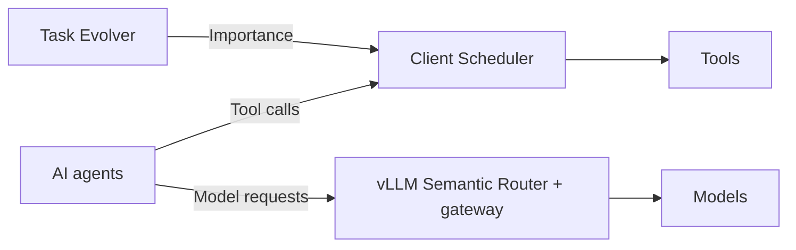
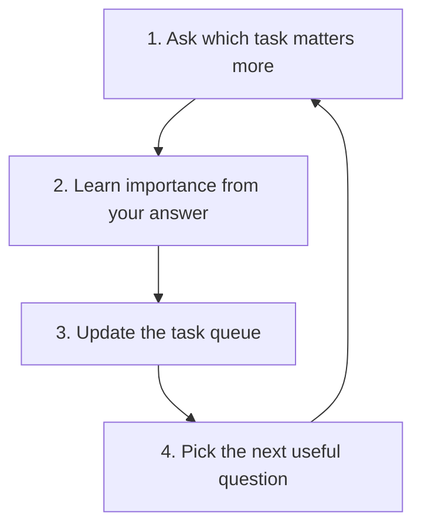

# IASES

**Importance-Aware Self-Evolving Scheduler for AI Agents**

Help AI agents decide **what matters, which tools run next, and which model to use**.

The demo simulates a wafer-fab incident competing with background tasks. It is inspired by TSMC operations, but is not affiliated with TSMC.

## Architecture



## Three main components

### 1. 🧠 Task Evolver: What matters?

- **Ask:** select a useful task pair and collect a human score from 0 to 1.
  Use 1 for A, 0 for B, or 0.5 for equal importance.
- **Learn:** fit importance scores with Bradley–Terry and expand related tasks with an LLM.
  Human preferences take precedence over low-weight AI-derived pairs.
- **Update:** publish new scores while scheduling continues.

### 2. ⏱️ Client Scheduler: What runs next?

- **Coordinate:** share a tool-call queue across Codex sessions.
- **Prioritize:** rank tasks by `importance + waiting time × rate`.
- **Control:** limit concurrent calls and release slots when they finish.

### 3. 🔀 vLLM Semantic Router: Which model should respond?

- **Classify:** identify the request type, such as a summary or incident diagnosis.
- **Route:** send summaries to a low-cost model and diagnosis to a stronger model.
- **Compare:** support quality-cost selection with the custom HierShrink selector.
  HierShrink is not yet enabled in the live gateway.

### Task Evolver loop



## 🚀 Start with Docker

Install Docker with Compose v2.

```sh
cp .env.example .env
docker compose up -d --build --wait
```

Open **http://localhost:5173**. The stack starts a mock frontend and real admission service.
The frontend is not connected to the backend. No API key is needed for the default stack.
See [setup instructions](DEVELOPMENT.md) to connect Codex or enable live routing.

## Bench

- **Replay:** 16,000 tool calls across 200 rounds. Linear aging at rate 0.25 kept critical wait close to strict priority while reducing background starvation.
- **Live Codex:** a recorded preemption run reduced critical-call wait from 4699 ms to 1 ms.
- **SWE pilot:** resolved 68/100 tasks, equal to the fixed-medium baseline.

These are separate experiments. The combined system still needs end-to-end validation.
See [benchmark details](BENCH.md) for workloads, measurements, and limitations.

## Development

See [backend setup and source layout](DEVELOPMENT.md).
