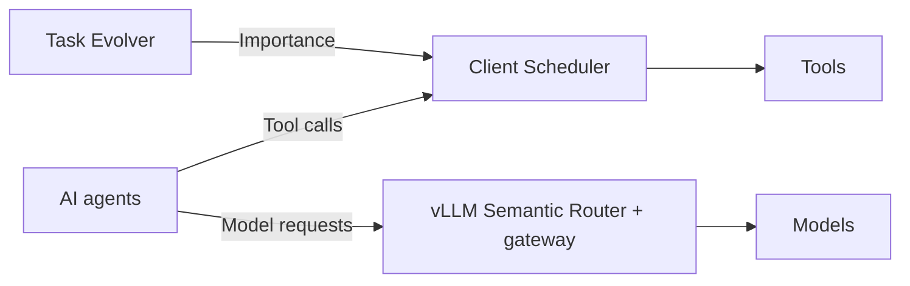
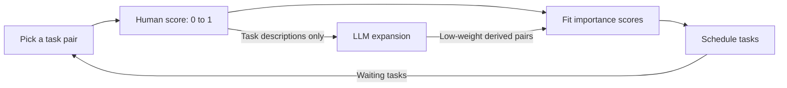

# IASES

**Importance-Aware Self-Evolving Scheduler for AI Agents**

Help AI agents decide **what matters, which tools run next, and which model to use**.

The demo simulates a wafer-fab incident competing with background tasks. It is inspired by TSMC operations, but is not affiliated with TSMC.

## Architecture



Simplified view. The frontend is mock, HierShrink is not enabled in live routing, and the combined system still needs end-to-end validation.

## Three main components

### 1. 🧠 Task Evolver: What matters?

- Learn task importance from human preference pairs.
- Convert preferences into scores with Bradley–Terry fitting.
- Publish updated scores for scheduling and routing policies.

<details>
<summary>Task Evolver loop</summary>



Pick a comparison that can affect the waiting queue. Learn from the human answer,
update importance with Bradley–Terry fitting, and use the scores for scheduling.
Repeat as tasks arrive. LLM expansion adds related tasks; human preferences take precedence.
Scheduling continues while the user answers. Each service run allows up to 10 questions.

</details>

### 2. ⏱️ Client Scheduler: What runs next?

- Coordinate tool calls across multiple Codex sessions.
- Rank waiting tasks by importance and aging.
- Limit concurrent tool calls and release slots when calls finish.

### 3. 🔀 vLLM Semantic Router: Which model should respond?

- Classify requests, such as alert summaries or incident diagnosis.
- Route summaries to a low-cost model and diagnosis to a stronger model.
- Support HierShrink quality-cost selection through our custom selector, not yet enabled in the live gateway.

**Importance is not model difficulty.** Tool scheduling and model selection are separate decisions.

## 🚀 Try the demo

Use Node 22.18 or newer.

```sh
cd apps/demo
npm ci
npm run dev
```

Trigger an incident, switch scheduling policies, and compare the queue and resource display.

**Frontend only:** tasks, CPU, and RAM are simulated. The UI is not connected to the backend components.

## Current status

| Area | What works | What remains |
| --- | --- | --- |
| Evolver + Scheduler | Preference scores, cross-session tool admission, resource pools, preemption, closed-loop tuning; 35 tests pass | Preemption and tuning in the replay benchmark; victim retry behaviour |
| Semantic routing | A prior Codex → OpenAI tool round trip completed in 6.585 seconds | Combined frontend, scheduler, and HierShrink validation |
| HierShrink | Go selector, exporter, and tests | Live routing integration and evidence of quality-cost gains |

### Scheduler benchmark

Offline replay, 200 rounds, 16,000 tool calls, 10 seeds per policy. Linear score = importance + wait × rate.

| Workload | Policy | Critical mean wait | Critical p95 wait | Background max wait | Background max unserved |
| --- | --- | --- | --- | --- | --- |
| Long tail | FIFO | 75.0 s | 139.6 s | 148.4 s | 52.2 s |
| Long tail | Strict priority | 5.8 s | 12.8 s | 155.4 s | 122.5 s |
| Long tail | Linear, rate 0.25 | 5.9 s | 12.8 s | 153.5 s | 87.3 s |
| Long tail | Linear, rate 1 | 41.3 s | 98.1 s | 151.1 s | 55.1 s |
| Uniform | FIFO | 38.3 s | 73.0 s | 76.7 s | 32.8 s |
| Uniform | Strict priority | 2.0 s | 5.1 s | 88.0 s | 73.6 s |
| Uniform | Linear, rate 0.25 | 2.0 s | 5.1 s | 81.5 s | 44.7 s |

Linear at rate 0.25 matches strict priority on critical wait and starves background sessions less. Live Codex run with preemption enabled: critical call wait dropped from 4699 ms to 1 ms. Aging policies collapsed to FIFO in this replay.

The first offline SWE pilot resolved 68/100 tasks, equal to fixed medium. It did not improve on that baseline. This is not a production deployment or a deadline guarantee.

## Development

<details>
<summary>Source layout</summary>

```text
apps/demo/                       Incident demo frontend
src/task-evolver/                Preference learning and shared admission
src/client-scheduler/            Codex scheduler crate
src/model-router/gateway/        Incident policy and Responses gateway
src/model-router/hiershrink/      Go model selector and tests
src/model-router/tools/          Exporter and offline pilot scripts
src/model-router/research/       Pilot's Python dependency subset
integrations/                    Pinned upstream revisions, patches, and adapters
scripts/prepare.py               Reconstruct the development workspace
```

Edit code in `src/`. Keep upstream wiring in `integrations/`.

Upstream sources, datasets, trained artifacts, credentials, caches, and binaries are not included. Patches modify existing upstream files. New adapter files live in `integrations/*/overlay/`. Licenses and notices remain under each integration.

</details>

<details>
<summary>Prepare the backend and run the routing smoke</summary>

Use Python 3.11 or newer and Git. The preparation command downloads the pinned upstream sources, applies patches, and copies our modules into their build locations.

```sh
python3 scripts/prepare.py
cd .work/codex
PYTHONPATH=tools/task-scheduler python3 -m unittest discover -s tools/task-scheduler/tests
```

Preparation requires a new destination. After source edits, use `--destination /path/to/new-workspace`. Do not edit the generated workspace as the source of record. All generated upstream files stay outside Git.

Build Codex and the native router libraries with their upstream build instructions in `.work/`. Set `OPENAI_API_KEY` in your environment or `.work/codex/.env`. Start the gateway from `.work/codex`:

```sh
PYTHONPATH=tools/task-scheduler python3 tools/semantic-router/run.py --router-root ../semantic-router
```

In another terminal, from `.work/codex`:

```sh
PYTHONPATH=tools/task-scheduler python3 tools/task-scheduler/experiments/semantic_router_probe.py --base-url http://127.0.0.1:18899/v1 --model incident-auto --output .cache/semantic-router/smoke.json
```

Use `--fast-model` and `--analysis-model` on the launcher to select model IDs available to your account. Keep the gateway on loopback; it has no client authentication.

</details>
